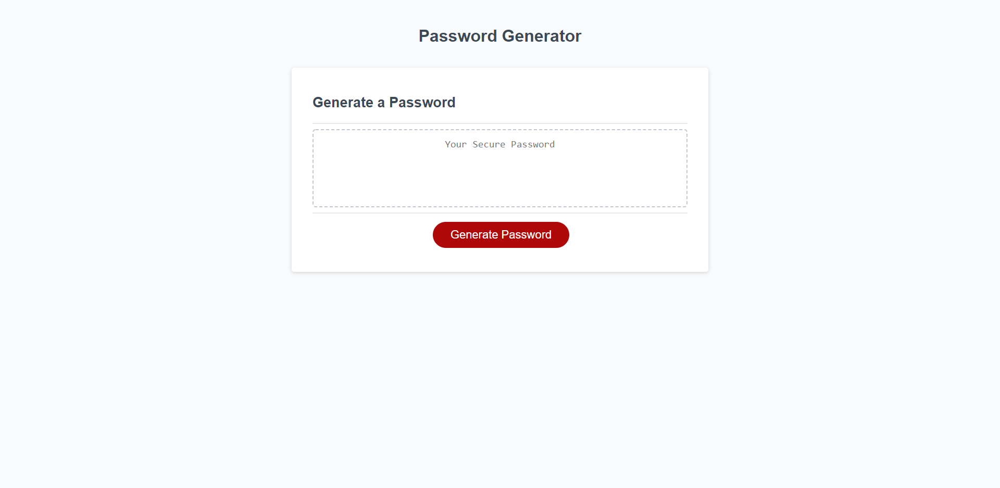

# 03 JavaScript: Password Generator Homework

UCSD-SD-FSF-PT-03-2021-U-C-MW

## Github repository and published webpage links below

[GitHub link](https://github.com/djony88/03_JavaScript-Password-Generator)

[Published Webpage](https://djony88.github.io/03_JavaScript-Password-Generator/)

Requirement:

* Want to create new secure password ny clicking generate button.
* Present prompt window with password criteria. (Password length, special characters, upper case letters, lower case letters and numbers)
* Select criteria to inclode in password.
* Choose length of at least 8 and not more than 128 characters.
* Select character types.
* When answered all propts at least one criteria needs to be selected.
* When all criteria is selected password is generated and displayed on the page.

JavaScript:

* Adding selectors.
* Adding Function for the adding prompt windows.
* If no input what message to show.
* If input is not a number what message to show.
* If length is not between 8 and 128 what message to show.
* Prompt windows to choose what criteria for password to be generated.
* If non of criteria is selected what message to show.
* User selections and random math function.

### Web page screenshot preview below

